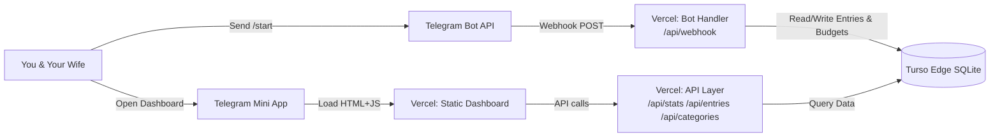
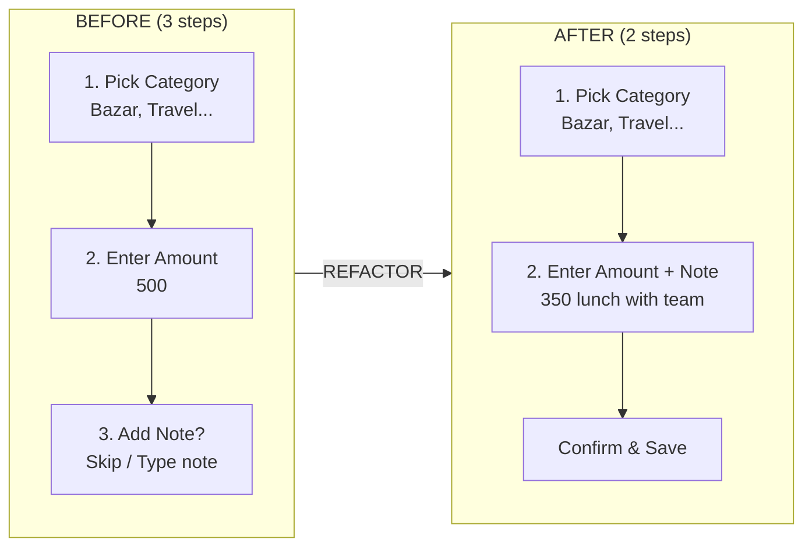
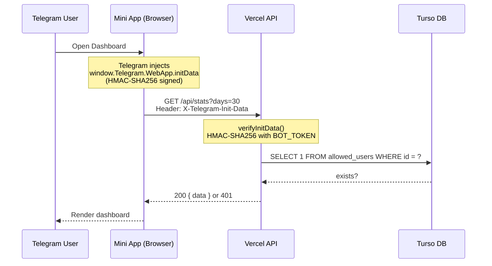

*This is a submission for the [GitHub Finish-Up-A-Thon Challenge](https://dev.to/challenges/github-2026-05-21)*

---

## What I Built

**Yunus** is a shared finance tracker for couples — built as a Telegram bot with a built-in web dashboard. My wife and I use it daily to track every expense across 14 categories (Bazar, Travel, Rent, Bills, and yes — a category literally called **"Wife"**). Everything is shared. Everything is real-time. Zero passwords.

The entire thing fits in under a thousand lines of TypeScript.



**System overview**: You interact with the bot through Telegram. The bot handler runs as a Vercel serverless function. The dashboard is a React SPA served as a Telegram Mini App. All data lives in Turso — a globally distributed SQLite database.

### Why Telegram?

Most finance apps are designed for individuals. No one builds for couples. And the ones that exist (Splitwise, Honeydue) are over-engineered for what we needed: *"hey, how much did we spend on bazar this week?"*

Telegram was the perfect foundation because:

- **Mini Apps**: Native WebView dashboards baked right into the chat app — no separate app to install.
- **Zero-login auth**: Telegram injects cryptographically signed user data into every Mini App. No signup flow.
- **Cross-platform**: Works identically on iOS and Android through Telegram.
- **Bot interface**: Adding an expense is as fast as typing a message.

---

## Demo

**GitHub Repository**: [https://github.com/ShatilKhan/yunus](https://github.com/ShatilKhan/yunus)

### Screenshots

*Upload screenshots to Dev.to's image CDN and replace the URLs below:*

| Screenshot | What it shows |
|------------|---------------|
| `[Upload: start-menu.jpg]` | The `/start` command — inline keyboard with all actions |
| `[Upload: budget-view.jpg]` | Budget view showing spent, remaining, and over-since date |
| `[Upload: dashboard.jpg]` | Dashboard with stats cards, pie chart, and transaction table |
| `[Upload: entry-flow.jpg]` | Adding an expense with inline note parsing |

---

## The Comeback Story

My original build was a 24-hour sprint. I sat down on May 1st, 2026, and cranked out **20 commits in a single day**. The skeleton worked — you could add expenses, see summaries, and it had a budget feature. But it was rough.

```text
May  1 — 20 commits: initial scaffold, bot, API, dashboard, everything
May  5 —  3 commits: budgets, summaries, backfill (unfinished)
         ╰──── 26 days of nothing ────╯
May 31 —  3 commits: the comeback — 195 lines changed, 6 files
```

The 26-day gap wasn't laziness. It was the realization that the product *almost* worked, but the friction points were killing the experience. Every day I thought "I'll fix it tomorrow" — and I didn't.

Then the GitHub Finish-Up-A-Thon challenge gave me the push I needed.

### What was broken

**1. The entry wizard took three steps when it should take two.**

Original flow: Pick category → Type amount → *"Add a note? (Skip)"* → Confirm. That extra note step with a Skip button was a tiny thing that added up to major friction. When you're logging 5-6 transactions a day, an extra tap per entry is **150-180 extra taps a month** for skipping a step you usually skip anyway.

**2. Budget editing didn't exist.**

You could set a budget, but you couldn't adjust it. If you wanted to bump the amount up, you had to close the entire budget and create a new one — which triggered an auto-savings of the remainder.

**3. No "over since" date.**

When the bot alerted that we were over budget, it just said "Over by 5000 Taka." It never told us *when* we went over. Was it day 3 of the month or day 25? That matters for next month's planning.

**4. Bulk backfill was missing.**

If I forgot to log a day's expenses, I had to add entries one at a time — going through the full wizard each time. The "Add Multiple" feature existed for today's date, but not for past dates.

**5. The dashboard had no CSS.**

This was the most embarrassing one. I had beautiful shadcn components (cards, charts, tables) and the build was compiling them... but **no one ever imported the CSS file**. The dashboard rendered as raw unstyled HTML. It *worked*. It looked terrible.

### The incremental note hack — my favorite fix

This is the kind of fix that's obvious in hindsight but painful in practice.



The hack is **parsing the amount and note from a single input**:

```typescript
// handlers.ts — the "amount" step now parses inline notes
const trimmed = text.trim();
const firstSpace = trimmed.search(/\s/);
const amountStr = firstSpace === -1 ? trimmed : trimmed.slice(0, firstSpace);
const noteRaw = firstSpace === -1 ? "" : trimmed.slice(firstSpace + 1).trim();
const amount = Number(amountStr);

await setSession(`wizard:${userId}`, {
  step: "confirm",
  amount,
  note: noteRaw || null, // null = no note, no extra step
});
```

Now you type `350 lunch with team` — it parses `350` as the amount and `lunch with team` as the note. **No extra step. Straight to confirmation.** I also deleted the entire `skip_note` callback — 17 lines of dead code that existed only to handle a step that shouldn't have existed.

### What the comeback changed

| Fix | Lines changed | Impact |
|-----|---------------|--------|
| Inline note entry | +47 / -22 | 2-step wizard, removed Skip button entirely |
| Editable budgets | +14 / -0 | Change budget amount in-place |
| Over-budget date | +19 / -3 | See exact date budget was exceeded |
| Bulk backfill | +52 / -3 | Bulk import for past dates |
| Dashboard CSS | +15 / -2 | Tailwind styling + safe date parsing |
| Webhook migration | +28 / -1 | Schema migration on cold starts |

---

## The Hack: Zero-Login Auth via Telegram initData

This is the most interesting architectural decision: **how authentication works without a single login screen**.



Every Telegram Mini App receives a `window.Telegram.WebApp.initData` string that's cryptographically signed with HMAC-SHA256 using your bot token. The frontend attaches this as an HTTP header:

```typescript
// useAuth.ts — attaches initData to every fetch
const apiFetch = useCallback(async (endpoint, options = {}) => {
  const res = await fetch(endpoint, {
    ...options,
    headers: {
      "X-Telegram-Init-Data": initData, // Telegram-signed payload
      "Content-Type": "application/json",
    },
  });
  return res;
}, [initData]);
```

On the backend, every endpoint verifies:

```typescript
// auth.ts — HMAC-SHA256 verification
export function verifyInitData(initData: string) {
  const params = new URLSearchParams(initData);
  const hash = params.get("hash");
  params.delete("hash");

  // Sort alphabetically, rebuild check string
  const dataCheckString = entries
    .sort((a, b) => a[0].localeCompare(b[0]))
    .map(([key, value]) => `${key}=${value}`)
    .join("\n");

  // Derive secret key from bot token
  const secretKey = crypto
    .createHmac("sha256", "WebAppData")
    .update(botToken)
    .digest();

  // Verify hash
  const checkHash = crypto
    .createHmac("sha256", secretKey)
    .update(dataCheckString)
    .digest("hex");

  if (checkHash !== hash) return null; // Tampered data
  return JSON.parse(decodeURIComponent(params.get("user")!));
}
```

### Why this matters

This pattern — **cryptographic identity via the chat platform** — is incredibly powerful for internal tools:

- **No onboarding**: First person to message the bot becomes admin. Add whitelisted users via `/admin add <id>`.
- **No password rotation**: Telegram handles security.
- **No session management**: Every request is self-verifying.
- **Shared by default**: All whitelisted users see the same data — exactly what you want for a couple's finances.

---

## The Why: A generalizable pattern

This isn't just a finance tracker. The **shared Telegram bot + Mini App** pattern applies to any two-person dataset:

1. **Shared shopping lists** — both partners add items, check them off in real-time.
2. **Chore tracking** — log who did what, when.
3. **Pet care schedules** — feeding, medication, walks.
4. **Any "two people need to share one simple dataset" scenario.**

The key insight: **if your users already use Telegram, you don't need a separate app.** You don't need login screens. You don't need onboarding flows. You just need a bot that responds to messages and a Mini App that displays data.

---

## My Experience with GitHub Copilot

Every line of this project was written with GitHub Copilot. Not as a "generate the whole app" tool — more like a rubber duck that never gets tired.

Copilot was most useful in three scenarios:

**1. Boilerplate generation.** The initial scaffold — bot setup, database schema, API handlers — is the most tedious part. Copilot predicted the next 5-10 lines consistently, turning 30-minute tasks into 5-minute ones.

**2. SQL query construction.** I'm decent at TypeScript, but SQL is where I need the most help. Copilot's suggestions for aggregation queries were correct on the first try:

```typescript
// Copilot wrote the CASE WHEN inside SUM and GROUP BY
const totalsResult = await db.execute(`
  SELECT
    SUM(CASE WHEN c.type = 'expense' THEN e.amount ELSE 0 END) as total_expense,
    SUM(CASE WHEN c.type = 'saving' THEN e.amount ELSE 0 END) as total_saving,
    COUNT(*) as transaction_count
  FROM entries e
  JOIN categories c ON e.category_id = c.id
  WHERE e.created_at >= datetime('now', '-' || ? || ' days')
`, [Number(days)]);
```

**3. The comeback push.** The May 31 commits were the most Copilot-heavy session. By then, Copilot understood the codebase well enough that suggesting `updateBudgetAmount()` or the date-parsing fallback felt like autocomplete.

The one thing Copilot couldn't help with was **debugging production issues** (CSS not loading, missing webhook migrations). Those required understanding the deployment flow — where code runs vs. where it doesn't — which no AI had enough context for.

---

## The Stack

| Layer | Tool | Why |
|-------|------|-----|
| **Runtime** | Bun 1.x | Fast Node.js alternative, built-in bundler |
| **Bot Framework** | Grammy.js | Telegram bot lib with TypeScript types |
| **Frontend** | React 19 | SPA rendering |
| **UI** | shadcn/ui (New York) | Copy-paste components, full control |
| **Charts** | Recharts 3.8.0 | Pie chart breakdown |
| **Styling** | Tailwind CSS v4 | Utility-first CSS |
| **Database** | Turso (edge SQLite) | Globally distributed SQLite via HTTP |
| **Hosting** | Vercel | Serverless functions + static hosting |
| **Auth** | Telegram initData + HMAC | Zero-login, no passwords |
| **Icons** | Lucide React | Clean icon set |

### The unusual choice: Turso (edge SQLite) over PostgreSQL

Turso is SQLite turned into a distributed database. It speaks the same SQL you already know, accessible via HTTP from serverless functions. The tradeoff: single-writer (no concurrent global writes) — irrelevant for a couple's finance tracker. The gain: zero connection pooling, zero migration tooling, zero ops, and the same SQLite syntax you'd use locally.

---

## Production Gotchas

These are the bugs that almost made me give up. **This is the most bookmarked section — save it.**

### 1. CSS never loaded on the dashboard

- **Symptom**: Dashboard rendered as unstyled HTML. Cards had no backgrounds. Tables had no borders.
- **Cause**: `build.ts` used `bun-plugin-tailwind` but no file imported the CSS. `index.css` existed. `globals.css` existed. Neither was referenced.
- **Fix**: One import line:
  ```typescript
  // frontend.tsx
  import "./index.css";
  ```

### 2. Webhook cold starts missed schema migrations

- **Symptom**: Budget tracking returned "No active budget" even though budgets existed. No errors.
- **Cause**: `initSchema()` only ran in the local dev server (`src/index.ts`). The production webhook handler (`api/webhook.ts`) never called it. New column = query failed = catch returned `null`.
- **Fix**: Two changes — added migration to webhook handler AND made the query resilient:
  ```typescript
  export async function getActiveBudget() {
    try {
      // Try with new column
      const result = await db.execute(
        "SELECT id, amount, start_date, alert_sent, over_budget_date FROM budgets WHERE end_date IS NULL"
      );
    } catch {
      // Fallback: column doesn't exist yet
      const result = await db.execute(
        "SELECT id, amount, start_date, alert_sent FROM budgets WHERE end_date IS NULL"
      );
    }
  }
  ```

### 3. `new Date()` is not your friend

- **Symptom**: Dashboard showed "Invalid Date" for every entry — but only on some devices.
- **Cause**: SQLite returns `"2026-05-31 14:30:00"` (space-separated). `new Date()` behavior with space-separated strings varies by browser. Telegram's Mini App WebView (Safari on iOS) returns `Invalid Date`.
- **Fix**: Manual parsing:
  ```typescript
  const formatDate = (dateStr: string) => {
    const parts = dateStr.split(/[\sT]/);
    const dateParts = parts[0]!.split("-").map(Number);
    const timeParts = (parts[1] || "00:00:00").split(":").map(Number);
    const date = new Date(
      dateParts[0]!, (dateParts[1] || 1) - 1, dateParts[2] || 1,
      timeParts[0] || 0, timeParts[1] || 0, timeParts[2] || 0
    );
    if (isNaN(date.getTime())) return dateStr; // fallback to raw string
    return date.toLocaleDateString("en-US", { /* ... */ });
  };
  ```

### 4. Amount columns returned `NaN`

- **Symptom**: Random entries showed `NaN` instead of `500.00`.
- **Cause**: `Number(entry.amount).toFixed(2)` — if `amount` is `undefined` or `null`, `Number(undefined).toFixed(2)` = `"NaN"`.
- **Fix**:
  ```typescript
  {Number(entry.amount ?? 0).toFixed(2)}
  ```

### 5. The over_budget_date column didn't exist in production

- **Symptom**: After deploying, the bot couldn't find active budgets.
- **Cause**: The ALTER TABLE migration ran only in the local dev server. Vercel serverless functions are fresh processes — the webhook handler never ran it.
- **Fix**:
  ```typescript
  // webhook.ts — runs on every cold start
  async function runMigrations() {
    try {
      await db.execute("ALTER TABLE budgets ADD COLUMN over_budget_date DATE");
    } catch {
      // Column already exists — fine
    }
  }
  ```

---

## Quick Reference

Deploy your own in 8 steps:

```bash
# 1. Clone
git clone https://github.com/ShatilKhan/yunus
cd yunus

# 2. Install dependencies
curl -fsSL https://bun.sh/install | bash
bun install

# 3. Create a Telegram bot
#    Message @BotFather → /newbot → save the token

# 4. Set up Turso database
turso auth login
turso db create yunus
turso db show yunus --url       # → TURSO_DATABASE_URL
turso db tokens create yunus    # → TURSO_AUTH_TOKEN

# 5. Set environment variables
#    BOT_TOKEN, TURSO_DATABASE_URL, TURSO_AUTH_TOKEN
#    WEBHOOK_SECRET (random string for webhook auth)
#    DASHBOARD_URL (your Vercel URL)

# 6. Deploy to Vercel
vercel --prod

# 7. Set Telegram webhook
#    POST https://api.telegram.org/bot<TOKEN>/setWebhook
#    ?url=https://<your-domain>/api/webhook
#    &secret_token=<WEBHOOK_SECRET>

# 8. Start using it
#    Open Telegram → message your bot → /start
#    You're admin. Add your partner:
#    /admin add <their-telegram-id>
```

**Build it. Use it. Stop wondering where your money went.**

---

*Built with TypeScript, Bun, Grammy.js, Turso, Tailwind CSS v4, shadcn/ui, Recharts, React 19, and GitHub Copilot. Open source at [github.com/ShatilKhan/yunus](https://github.com/ShatilKhan/yunus).*
